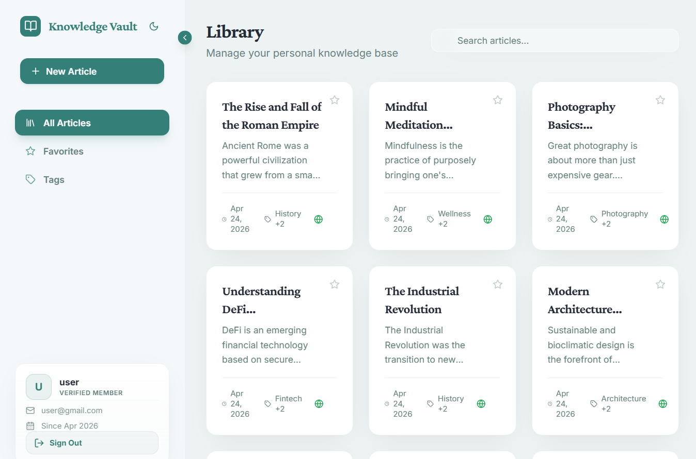
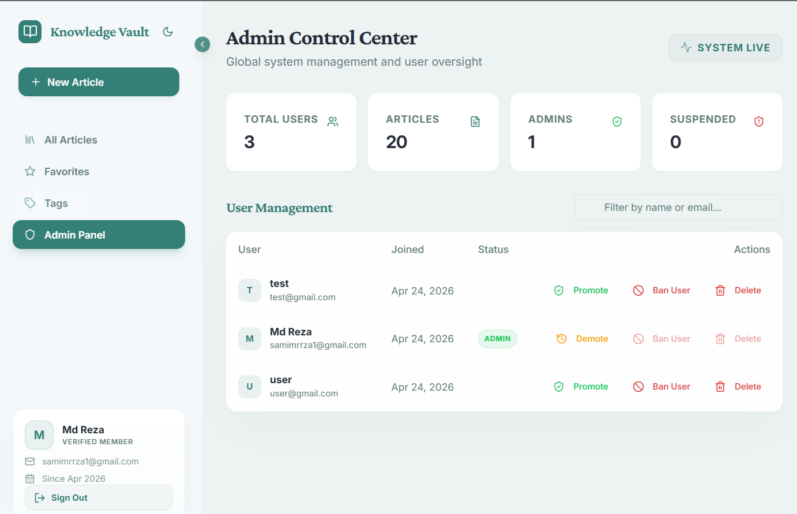

# 🧠 Knowledge Vault

> A full-stack personal wiki and knowledge base — write in Markdown, link articles together, manage access, and keep a full version history.


[](LICENSE)
[](https://nodejs.org)
[](https://www.typescriptlang.org/)
[](https://www.mongodb.com/)

---

## 📸 Screenshots

| Desktop View | Mobile View |
|---|---|
|  |  |

| Admin Panel |
|---|
|  |

---

## ✨ Features

### 📝 Articles

- Write and edit articles in **Markdown** with a live preview split-pane
- **Public / private** visibility toggle per article
- **Tags** for organization and filtering
- Auto **slug generation** from titles
- Full **version history** with diff view and one-click restore
- Version entries track: timestamp, action (`CREATED` / `UPDATED` / `RESTORED`), and editor username

### 🔗 Wiki Linking

- `[[Article Title]]` syntax creates internal links between articles
- Missing articles are visually marked as broken links
- Visibility rules are respected — private article existence is never leaked to unauthorized users
- Mobile/tablet touch behavior uses native links for reliability

### 🔍 Search & Discovery

- Full-text search powered by **MongoDB text indexes**
- Filter by **tags** or **favorites**
- Reverse chronological article listing

### 🔐 Authentication

- Register, login, logout
- **Session-based auth** via `express-session` + `connect-mongo`
- **Password reset via email OTP** with rate limiting and attempt caps
- Active sessions are invalidated after password reset

### 🛡️ Admin Panel

- View user and article statistics
- Promote / demote admins
- Ban / unban users
- Delete users
- **OTP confirmation** for high-risk actions
- **Master key verification** for super-admin operations
- User sessions are automatically invalidated on ban or delete

---

## 🛠️ Tech Stack

### Frontend

| Tech | Purpose |
|---|---|
| React 18 + TypeScript | UI framework |
| Vite 7 | Dev server & bundler |
| Wouter | Client-side routing |
| TanStack Query | Server state & caching |
| React Hook Form + Zod | Forms & validation |
| Tailwind CSS | Styling |
| Radix UI / shadcn | Accessible UI components |
| Lucide React | Icons |

### Backend

| Tech | Purpose |
|---|---|
| Express 5 + TypeScript | HTTP server |
| MongoDB + Mongoose | Database & ODM |
| express-session + connect-mongo | Session management |
| bcryptjs | Password hashing |
| nodemailer | OTP email delivery |
| express-rate-limit | Request throttling |
| helmet + cors | Security headers |

### Tooling

- **Vitest** — unit testing
- **tsx / esbuild** — fast TS execution and bundling

---

## 📁 Project Structure

```
Knowledge-Vault/
├── api/
│   └── index.ts          # Vercel serverless function entrypoint
├── client/
│   ├── public/
│   │   ├── adminPanel.png
│   │   ├── banner.png
│   │   ├── laptopScreen.png
│   │   └── mobileScreen.png
│   ├── index.html
│   └── src/
│       ├── components/
│       ├── hooks/
│       ├── lib/
│       ├── pages/
│       ├── main.tsx
│       └── index.css
├── server/
│   ├── lib/
│   ├── middleware/
│   ├── routes/
│   ├── types/
│   ├── db.ts
│   ├── index.ts
│   ├── models.ts
│   ├── static.ts
│   ├── storage.ts
│   └── vite.ts
├── shared/
│   ├── routes.ts
│   ├── schema.ts
│   └── wiki-links.ts
├── scripts/
├── vercel.json           # Vercel deployment configuration
├── package.json
└── tsconfig.json
```

---

## 🚀 Getting Started

### Prerequisites

- Node.js 18+
- MongoDB instance (local or Atlas)
- SMTP credentials for OTP email delivery

### 1. Clone & Install

```bash
git clone https://github.com/mdsamimrrza/knowledgeBase.git
cd knowledgeBase
npm install
```

### 2. Configure Environment

Create a `.env` file in the root:

```env
MONGODB_URI=mongodb+srv://<user>:<password>@cluster.mongodb.net/knowledge-vault

SESSION_SECRET=replace-with-a-long-random-secret
JWT_SECRET=replace-with-a-jwt-secret

SUPER_ADMIN_EMAIL=admin@example.com
ADMIN_SECRET_KEY=replace-with-super-admin-master-key

EMAIL_USER=your-smtp-user
EMAIL_PASS=your-smtp-password
SMTP_HOST=smtp.gmail.com
SMTP_PORT=587

PORT=3000
NODE_ENV=development
CORS_ORIGINS=http://localhost:3000,http://localhost:5173
```

> ⚠️ `SESSION_SECRET` must be long and random. Never commit `.env` to version control.

### 3. Run in Development

```bash
npm run dev
```

App runs at → **<http://localhost:3000>**

### 4. Build for Production

```bash
npm run build
npm start
```

---

## 🔌 API Reference

<details>
<summary><strong>Auth</strong></summary>

| Method | Endpoint | Description |
|---|---|---|
| GET | `/api/auth/me` | Get current session user |
| POST | `/api/auth/register` | Register new user |
| POST | `/api/auth/login` | Login |
| POST | `/api/auth/logout` | Logout |
| POST | `/api/auth/forgot-password` | Request OTP |
| POST | `/api/auth/verify-otp` | Verify OTP |
| POST | `/api/auth/reset-password` | Reset password |

</details>

<details>
<summary><strong>Articles</strong></summary>

| Method | Endpoint | Description |
|---|---|---|
| GET | `/api/articles` | List all articles |
| GET | `/api/articles/:id` | Get article by ID |
| GET | `/api/articles/slug/:slug` | Get article by slug |
| POST | `/api/articles` | Create article |
| PUT | `/api/articles/:id` | Update article |
| DELETE | `/api/articles/:id` | Delete article |
| POST | `/api/articles/resolve-titles` | Resolve wiki link titles |
| GET | `/api/articles/:id/versions` | Get version history |
| POST | `/api/articles/:id/versions/:versionId/restore` | Restore version |

</details>

<details>
<summary><strong>Favorites</strong></summary>

| Method | Endpoint | Description |
|---|---|---|
| POST | `/api/favorites/:articleId` | Add to favorites |
| DELETE | `/api/favorites/:articleId` | Remove from favorites |

</details>

<details>
<summary><strong>Admin</strong></summary>

| Method | Endpoint | Description |
|---|---|---|
| GET | `/api/admin/stats` | Get stats |
| GET | `/api/admin/users` | List users |
| PATCH | `/api/admin/users/:id` | Update user |
| DELETE | `/api/admin/users/:id` | Delete user |
| POST | `/api/admin/users/:id/verify-master-key` | Verify master key |
| POST | `/api/admin/users/:id/request-otp` | Request OTP |
| POST | `/api/admin/users/:id/confirm-promote` | Confirm promote |
| POST | `/api/admin/users/:id/confirm-demote` | Confirm demote |
| POST | `/api/admin/users/:id/confirm-ban` | Confirm ban |
| POST | `/api/admin/users/:id/confirm-delete` | Confirm delete |
| POST | `/api/admin/users/:id/confirm-self-demote` | Confirm self demote |

</details>

---

## 🧪 Testing

```bash
# Run tests
npm test

# Watch mode
npm run test:watch

# Coverage report
npm run test:coverage

# Type check
npm run check
```

> On Windows PowerShell, if `tsc` is blocked by execution policy:
>
> ```
> cmd /c npx.cmd tsc --noEmit --incremental false --ignoreDeprecations 5.0
> ```

---

## 📜 NPM Scripts

| Script | Description |
|---|---|
| `npm run dev` | Start development server |
| `npm run build` | Production build |
| `npm start` | Start production server |
| `npm run check` | TypeScript type check |
| `npm test` | Run tests |
| `npm run test:watch` | Test watch mode |
| `npm run test:coverage` | Coverage report |
| `npm run script:promote-admin` | Promote a user to admin via CLI |
| `npm run script:cleanup-user` | Cleanup a user via CLI |

---

## 🔒 Security Notes

- Raw HTML rendering is removed from Markdown display (XSS prevention)
- Session checks validate against deleted/banned user state on every request
- Password reset is protected with input validation, rate limiting, OTP attempt caps, and verified reset state
- Private article existence is never leaked to unauthorized users through wiki link resolution
- Admin actions invalidate user sessions immediately on ban/delete
- CSP is configured via `helmet` in `server/index.ts` — update directives if you add external assets

---

## ☁️ Deployment

Configured for **Vercel** deployment using **Vercel Serverless Functions** for the Express backend and **Vercel Static Hosting** for the React Vite frontend.

**Deployment Steps:**

1. Push your changes to GitHub and import the project into **Vercel**.
2. Set up Environment Variables in Vercel Project Settings:
   - `MONGODB_URI`
   - `SESSION_SECRET`
   - `SMTP_HOST`, `SMTP_PORT`, `SMTP_USER`, `SMTP_PASS`, `SMTP_FROM`
   - `VITE_NEURAL_QUERY_URL`
   - `CORS_ORIGINS` (e.g., `https://knowledge-vault-silk.vercel.app`)
3. Vercel reads `vercel.json` and `api/index.ts` automatically to route both static assets and API requests seamlessly.

**Health check endpoint:**

```
GET /healthz
```

---

## ⚠️ Known Issues / Follow-ups

- Auth responses still return a JWT even though the app uses session-based auth
- `jsonwebtoken` uses a local type shim at `server/types/jsonwebtoken.d.ts`
- Edit permissions are intentionally broader than delete permissions
- Screenshots in `client/public/` should be refreshed after significant UI changes

---

## 📄 License

[MIT](LICENSE) © [mdsamimrrza](https://github.com/mdsamimrrza)
